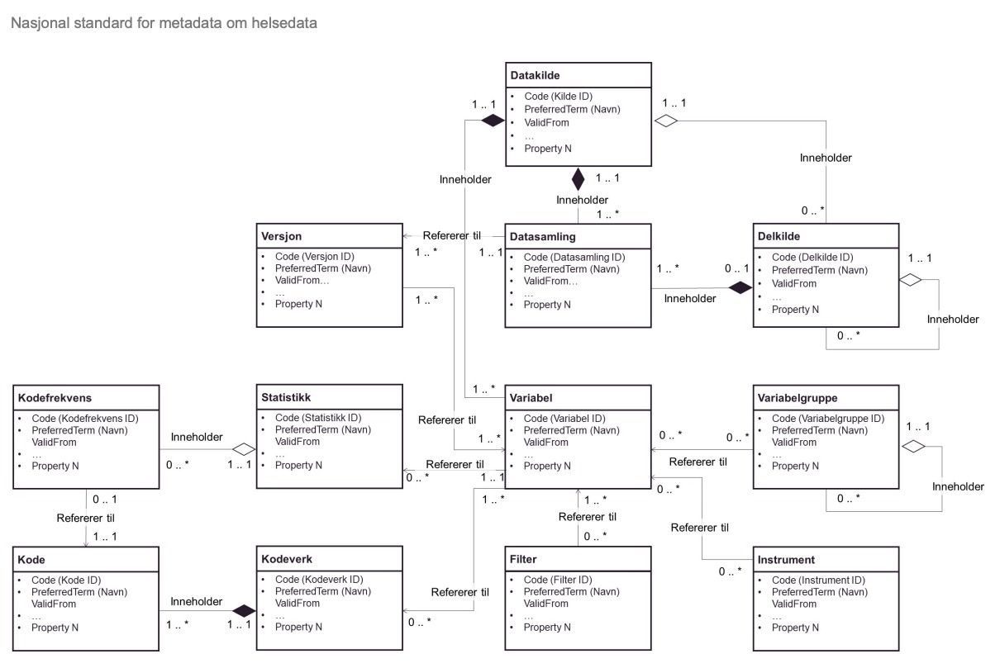

= Logisk informasjonsmodell for metadata om helsedata [[informasjonsmodell]]

Dette kapittelet introduserer den logiske informasjonsmodellen for metadata om helsedata til
sekundærbruk, som illustrert i Figur 1. Med logisk informasjonsmodell menes hvilke klasser
som inngår i informasjonsmodellen og hvordan de logiske relasjonene mellom de ulike
klassene skal håndteres. Kapittel 3 beskriver hvordan dette konkret skal håndteres i dagens
tekniske løsning.

Informasjonsmodellen i Figur 1 er utvidet med et flere nye klasser fra versjon 1.0 av denne
spesifikasjonen. Ikke alle klassene er obligatoriske, og enkelte vil kun være relevant for kun
enkelte typer av datakilder. I Vedlegg 3: Obligatoriske og frivillige klasser i den logiske
informasjonsmodellen, redegjøres det nærmere for hvilke klasser som er obligatoriske og
frivillige, samt hvilke som ikke skal benyttes. Dette gjøres for å synliggjøre hva som minimum
forventes av datakildene som skal rapportere inn metadata, samt hva det vil være mulig å
kunne rapportere inn.

For å forstå den logiske informasjonsmodellen i Figur 1 vil det være hensiktsmessig å ha
kjennskap til et utvalg begrep:

- Dataprodukt er ikke en klasse i modellen under, men en konseptuell betegnelse på
måten data skal overføres fra en datakilde til Helseanalyseplattformen. På et
konseptuelt nivå består dataprodukt av det faktiske datasettet, samt metadata om
variabler, versjon og datasamling. Sammenhengen mellom metadata og datasett som
overføres til Helseanalyseplattformen er forklart nærmere i Spesifikasjon for
dataoverføring til Helseanalyseplattformen.

- Datasett er ikke en klasse i informasjonsmodellen for metadata, men beskriver i
stedet de faktiske helse- og personopplysningene som en versjon av en datasamling
representerer. I Spesifikasjon for dataoverføring til Helseanalyseplattformen inngår
Datasett i den logiske informasjonsmodellen for relasjon mellom data og metadata og
betegner ett gitt sett med data som inngår i et dataprodukt som skal overføres til
Helseanalyseplattformen.

- Datakilde er definert som kildene til dataene. I denne versjonen av spesifikasjonen er
en datakilde ekvivalent med et helseregister, en helseundersøkelse eller et medisinsk
kvalitetsregister.

- Delkilde kan brukes dersom datakilden har ulike deler som må beskrives ut ifra en
logisk, kronologisk, juridisk eller populasjonsbasert betraktning. HUNT1, 2, 3 og 4 er
eksempel på delkilder. Denne kan ha flere nivåer. For datakilder som skal levere
dataprodukt til Helseanalyseplattformen, kan klassen Delkilde også brukes for å lage
logiske grupperinger av flere dataprodukt.

- Datasamling er definert som et sub-register innenfor en datakilde, altså en
delmengde av variablene i den aktuelle datakilden. Eksempler på datasamlinger kan
være skjema i medisinske kvalitetsregistre. Klassen datasamling skal også brukes til
å beskrive dataprodukter. 

Nasjonal spesifikasjon for metadata om helsedata
10

- Versjon er et teknisk hjelpemiddel som brukes til å definere hvilke variabler som
inngår i ulike årganger/versjoner av de ulike datasamlingene/dataproduktene i en
datakilde.

- Variabler er de informasjonsbærende elementene i datakilden og definerer hvilken
informasjon som finnes i de nasjonale helsedatakildene.

- Variabelgruppe er en kategorisering av variabler. Strukturen kan bygges opp
hierarkisk. Variabelgruppe erstatter den nå utgåtte propertien LokaltTema, men vil
også kunne brukes til å gruppere variabler på tvers av helsedatakilder.

- Kodeverk representerer i denne sammenhengen et verdisett. Et kodeverk kan for
eksempel være et administrativt kodeverk, et helsefaglig kodeverk eller egendefinerte
svaralternativer for en variabel.

- Kode er i denne sammenheng det samme som et svaralternativ i et kodeverk
(verdisett). En kode består av en kodeverdi og en kodetekst.

- Statistikk er definert som de statistiske egenskapene ved en årgang/versjon av en
variabel. Statistikk som metadata har som formål å si noe om registerings-/
kodingskvaliteten og gi en pekepinn om antall forekomster. Statistikken egner seg
ikke for analyse som sådan.

- Kodefrekvens er definert som antall gyldige tilfeller av et svaralternativ/utfall av en
variabel.

- Instrument kan benyttes i forbindelse med helseundersøkelser og medisinske
kvalitetsregistre. Det er en betegnelse på en standardisert innsamlingsmetode for
data. Dette kan være hele eller deler av et spørreskjema, eller et fysisk instrument for
f.eks. måling av bentetthet, analyse av prøvemateriale etc.

- Filter kan benyttes for å kategorisere variabler ved hjelp av kodeverk eller
egenskaper som ikke er definert som generelle properties i denne spesifikasjonen.
Et filterkodeverk kan f.eks. bestå av koder for Mor, Barn og Far, der en variabel som
kun benyttes for Far, knyttes til filteregenskapen Far.

En mer komplett oversikt over relevante fagbegrep er gjengitt i begrepslisten.

Informasjonsmodellen benytter seg videre av UML-baserte ikoner og begrep. Disse er
nærmere forklart i Tabell 1.

image::images/class.jpg[]

[options="header"]
|===
|Ikon |Definisjon |Beskrivelse
| image::images/class.png[]| Klasse |En klasse er en logisk gruppering av entiteter som beskriver en gitt del av modellen. Klasser kjennetegnes ved at de brukes til å beskrive en gitt type objekter. Eksempler på plasser er Variabel som brukes til å definere alle variablene i gitt datakilde.
| |Assosiativ relasjon |En assosiativ relasjon er den mest generelle formen for relasjon innenfor UML. I modellen under brukes assosiative relasjoner der det ikke er noen form for hierarkisk relasjon mellom klassene i form av en referer tilrelasjon.
| |Aggregerende relasjon |En aggregerende relasjon uttrykker at deler settes sammen til en større helhet, i invers forstand ofte kalt en «part of» relasjon. I modellen under brukes aggregerende relasjoner der en klasse kan inneholde av 0, 1 eller flere instanser av en sub-klasse.
|| Komposisjonrelasjon |En komposisjon-relasjon uttrykker er en spesiell form for en aggregerende relasjon i de tilfellene der det er et strengt krav at en klasse må inneholde minst én instans av en gitt sub-klasse.
|===

[link=images/informasjonsmodell.jpg, title="Logisk informasjonsmodell for metadata om helsedata"]image::images/informasjonsmodell.jpg[width=100%]

Punktlisten under forklarer informasjonslisten illustrert i Figur 1.

1. Hver datakilde, delkilde og datasamling er definert ut fra et sett med egne properties.

2. En datakilde kan inneholde null, én eller flere delkilder.

3. En datakilde eller delkilde inneholder én eller flere datasamlinger.

4. For helsedatakilder som leverer dataprodukt til Helseanalyseplattformen, skal klassen datasamling benyttes til å dokumentere metadata om dataprodukt. Klassen delkilde kan brukes til å gruppere dataprodukt og dokumentere metadata om logiske grupperinger av dataprodukt.

5. En datakilde inneholder variabler som er definert ut fra et sett properties om variabelen. Samme variabel kan inngå i flere datasamlinger. Det vil si at Datakilden i praksis inneholder en pool av alle variabler for alle datasamlingene under denne kilden. Derfor må en variabel være unik innenfor en datakilde.

6. Hver datasamling referer til en eller flere versjoner som definerer hvilke variabler som inngår i respektive versjoner av datasamlingen, og når datasamlingene er oppdaterte med nytt datagrunnlag.

7. Hver versjon refererer til en eller flere variabler. Det skal finnes minst en versjon som viser hvilke variabler som kan utleveres fra en datasamling. I tillegg kan det defineres versjoner som henviser til versjon av innrapporteringsskjema. Versjon brukes med dette også til å spesifisere hvilke variabler som inngår i hvilke dataprodukt for datakilder som skal levere dataprodukt til Helseanalyseplattformen.

8. Hver variabel kan referere til null, én eller flere variabelgrupper.

9. Variabler kan referere til kodeverk. For kategoriske variabler (variabler med svaralternativ) utgjør dette kodeverket variabelens standardiserte vokabular der kodeverket inneholder koder som representerer alle mulige verdier (svaralternativ) en variabel kan ha.

10. Hver variabel kan også referere til statistikk om seg selv, som gjennomsnitt, standardavvik og årstall statistikken er gyldig for. For kategoriske variabler kan statistikk inneholde kodefrekvens, det vil si antall utfall av de ulike mulige verdiene i variabelens standardiserte vokabular.

11. Hver variabel kan bli referert til fra null, ett eller flere instrument, og flere ulike
variabler kan bli referert til fra samme instrument.

