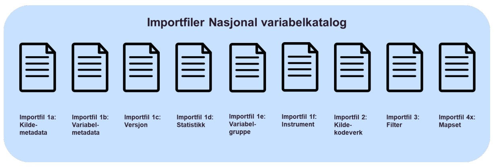

= Prosess for innrapportering av metadata [[innrapportering]]

Metadata om datakilder, datasamlinger, versjoner, variabler og kodeverk må i størst mulig grad speile datagrunnlaget i kildene, både i nåtid og historisk. Filstrukturen er utviklet blant annet for å kunne knytte versjoner av datasamlinger og variabler opp mot metadata og statistikk, på et gitt tidspunkt og/eller i en gitt periode. I første omgang er det lagt opp til årlige oppdateringer. Det vil også være mulig å gjøre oppdateringer hyppigere i de tilfellene der dette fremstår som hensiktsmessig. 
Det er ønskelig at innrapporteringsprosessen i størst mulig grad skal være automatisert. Ettersom dagens tekniske løsning for den nasjonale variabelkatalogen foreløpig ikke støtter automatisert innlesning av metadata, vil man i en overgangsfase legge opp til en prosess der de nasjonale helsedatakildene lager et sett med eksportfiler som sendes per e-post til metadata@helsedata.no.
Det utredes nærmere løsninger for automatisert mottak av metadata til Nasjonal variabelkatalog, og man tar sikte på å støtte mottak av oppdaterte metadatafiler via API i løpet av 2026. 

[link=images/manuell_innrapportering.jpg, title="Stegene for manuell innrapportering av metadata til HealthTerm og publisering til helsedata.no"]image::images/manuell_innrapportering.jpg[width=100%]

Figur 3 viser hvordan dagens prosess for oppdatering av metadata i Nasjonal variabelkatalog foregår. Det forutsettes at man har kontaktet Helsedataservice og planlagt en prosess for å inngå i økosystemet rundt Helsedata.no, Felles datakatalog og data.europa.eu. Arbeidet med å forvalte og tilgjengeliggjøre metadata fra den nasjonal
variabelkatalogen vil gjøres i nært samarbeid med forvalterne av de aktuelle datakildene og
metadata skal ikke eksponeres på helsedata.no eller andre kilder før forvalterne av dene nkelte datakilde har fått anledning til å kvalitetssikre og godkjenne innholdet. Det legges derfor opp til et kontrollregime der dataforvalterne gis anledning til å kontrollere egne variabler og metadata før disse publiseres åpent på helsedata.no. 

Ved førstegangs import av metadata er det mulig å bygge opp en endringshistorikk tilbake i tid ved å anvende properties ValidFrom og ValidTo. Variabler med ValidTo-dato må fjernes ved påfølgende oppdateringer. Historikk etter førstegangs import ivaretas ved at påfølgende filer importeres i kronologisk rekkefølge. ValidFrom settes til datoen innholdet gjelder fra. Dette styres i importgrensesnittet, og skal ikke angis i filen(e). HealthTerm sporer så automatisk alle endringer. Det anbefales at signifikante endringer i f.eks. kodeverk framgår av properties Beskrivelse eller Kommentar, og at signifikante kvalitetsbrister i datagrunnlaget framgår av propertien Kvalitetsnote. Det redegjøres nærmere for bruken av ValidFrom og ValidTo i kapittel 4.1.2.

Forvaltning av den nasjonale variabelkatalogen omfatter også tilrettelegging for harmoniseringsarbeid for realisering av Felles språk i helse- og omsorgssektoren, [9] samt videreutvikling av mappinger og relasjoner mot andre kodeverk, terminologier og standarder. Dette er illustrert i Figur 4. 

[link=images/figur_4.jpg, title=""]image::images/figur_4.jpg[width=100%]
image::images/figur_4.jpg[]

For å kunne realisere den logiske informasjonsmodellen i Kapittel 2, vil de nasjonale helsedatakildene bli bedt om å lage inntil ni ulike filtyper. Disse er illustrert i Figur 5. Merk at en datakilde i Nasjonal variabelkatalog vil ha behov for flere mapset, derav Importfil 4x. Merk videre at det i denne versjonen av spesifikasjonen ikke forventes at de nasjonale helsedatakildene skal rapportere Importfil 3: Filter selv.

[link=images/figur_5.jpg, title="Oversikt over filtyper som skal rapporteres til Nasjonal variabelkatalog"]image::images/figur_5.jpg[width=100%]

De ulike importfilene vil være basert på to ulike importformater i HealthTerm:

• 11+N-formatet: En fil med 11 obligatoriske properties, definert i HealthTerm, og med et ubegrenset antall tilleggsproperties som kan legges inn i løsningen. 11+N-formatet er standard format for import av Code Systems og tilhørende Extensions. Dette formatet skal benyttes for importfilene 1a,1b,1c,1d, 1e, 1f og 2.
• Format mappingfil: En fil bestående av tre kolonner: løpenummer, kilde (Source) og mål (Target), der ett (eller flere) concepts mappes til ett (eller flere) andre concepts. Dette vil være standard for importfil 4x-Mapset.
11+N-formatet og mappingformatet er nærmere dokumentert i CareCom sin egen dokumentasjon av løsningen og kan deles av Helsedataservice på forespørsel. 

*Prosess for oppdatering av innrapporterte metadata*

Oppdateringer av metadata gjøres ved at den eller de filene der ny informasjon er tilgjengelig sendes inn på nytt som en del av et komplett sett av importfiler. Dette gjøres for å sikre at metadataene til enhver tid er konsistente. Også feilretting gjøres ved å sende inn nye komplette filer. En oppdatering kan for eksempel være å legge til en ny variabel, fjerne en variabel som er utgått, endre navn på en variabel eller endre innholdet i en property. Nye variabler eller variabler som utgår må generere en ny Versjon
Historikk ivaretas av sporingsfunksjonaliteten i HealthTerm. Dato for når en endring ble gjeldene kan overstyres i importgrensesnittet.

*Bruk av systemproperties ValidFrom og ValidTo*

Systempropertiene ValidFrom og ValidTo har i etterkant av at versjon 1.0 av denne spesifikasjonen ble publisert, vært gjenstand for mye forvirring. I dette avsnittet redegjøres det derfor nærmere for betydningen av disse propertiene.

Når man oppretter et nytt concept i HealthTerm, får dette conceptet og alle tilhørende properties en history. En history vil være en komplett kronologisk hendelseslogg over alle endringer som skjer med et concept eller en property. Den første hendelsen i enhver history er en Create. Tidspunktet for denne, settes av ValidFrom fra importfil, eller fra en ValidFrom dato man velger i importgrensesnittet. Dette tidspunktet kan aldri endres, og man kan ikke legge til hendelser før dette tidspunktet i ettertid. Samme tidspunkt gjelder også for alle properities som tilhører conceptet. Da ValidFrom er en dato og hendelsen logges med et tidspunkt, defineres klokkeslett for hendelsen til 00:00:00.

Det er mulig å legge inn en ValidTo dato i importfilen, for å indikere at et concept ikke lenger skal være gyldig, eller at det på et tidspunkt tilbake i tid har opphørt å være gyldig. Bruk av ValidTo fører til en Retire hendelse, som er en avslutning på en history. NB! det er viktig å være klar over at det ikke tillates noen form for oppdateringer når denne datoen først er satt. 

Forsøk på dette fører til en feilhendelse i importgrensesnittet. Derfor anbefales at utgåtte concepter fjernes fra importfilene etter at denne oppdateringen har skjedd. 
Det er viktig å være klar over at en variabel som utgår på denne måten forsvinner fra variabelutforskeren. Det anbefales derfor at man beholder variablene intakt, og lar mappingen til versjon styre variablenes gyldighetsperiode. Hvis det er aktuellt, kan man merke variablene slik at de ikke kan utleveres.

Ved oppdatering av eksisterende concepts, har ValidFrom en endret betydning. ValidFrom vil da være hendelsestidspunkt for eventuelle endringer. Derfor skal ikke ValidFrom brukes i importfiler for endring. Endringer skal logges på et tidspunkt som styres i importgrensesnittet. NB! Hvis en endringsfil inneholder nye concepter, er det mulig å styre ValidFrom for enkeltconcepter. Dette vil kreve at man har full kontroll på hva som er levert til HealthTerm tidligere. Eller det må avtales spesielt med Helsedataservice.

