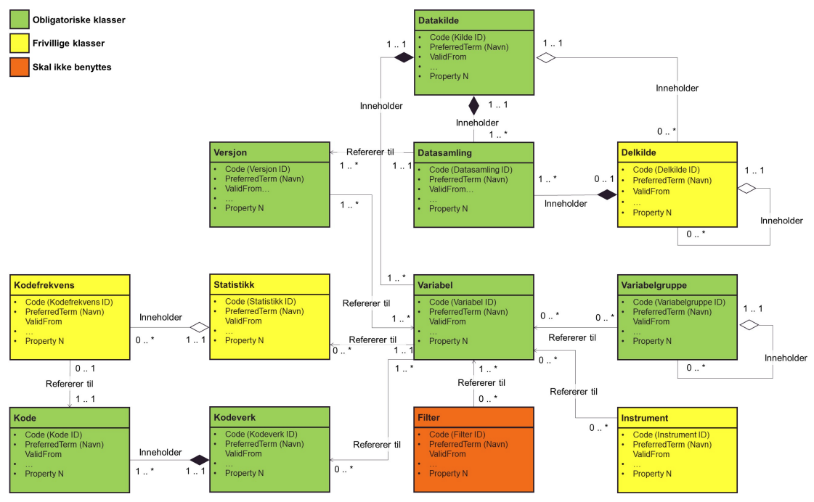

[appendix]
== Klasser i logisk informasjonsmodell [[klasser_i_logisk_informasjonsmodell]]

Informasjonsmodellen som ligger til grunn for denne spesifikasjonen er utvidet med flere nye klasser siden versjon 1.0 av spesifikasjonen. Dette er gjort for å muliggjøre en mer presis beskrivelse av nye typer datakilder som nasjonale medisinske kvalitetsregistre og befolkningsbaserte helseundersøkelser. +

De nye klassene er Delkilde, Variabelgruppe, Instrument og Filter. Utenom Variabelgruppe, som er løftet ut fra å være en obligatorisk egenskap ved klassen Variabel, er alle de nye klassene frivillige og skal kunne benyttes av aktører som selv opplever at de trenger disse
klassene for å gå en presis beskrivelse av datagrunnlaget i egen datakilde. Det er dermed ikke forventet at alle aktører skal ta i bruk alle de frivillige klassene.

[link=images/klasser_i_logisk_informasjonsmodell.png, title="Obligatoriske og frivillige klasser i Logisk informasjonsmodell for metadata om helsedata til sekundærbruk"]image::images/klasser_i_logisk_informasjonsmodell.png[width=100%]

