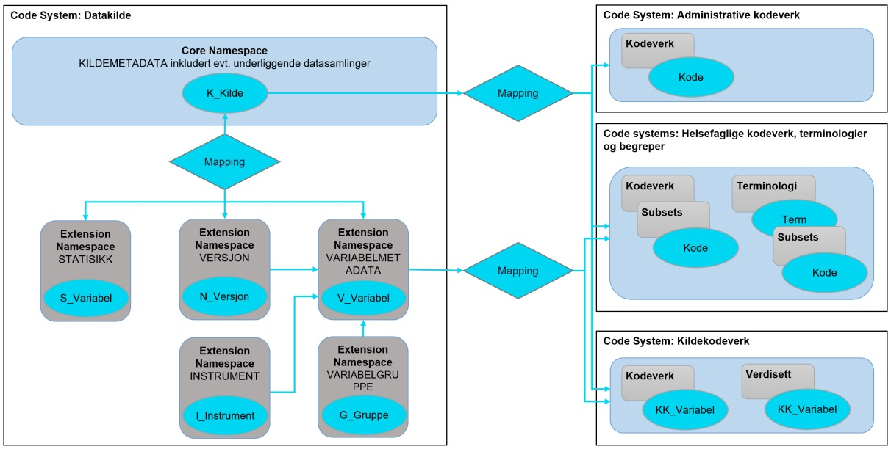

= Objektstruktur for helsedatakilder i Nasjonal variabelkatalog [[objektstruktur]]

Den valgte objektstrukturen i Nasjonal variabelkatalog reflekterer den logiske informasjonsmodellen definert i Figur 1 og er implementert innenfor mulighetsrommet som ligger i HealthTerm som løsning.

Figur 2 illustrerer hvordan objektstrukturen i HealthTerm skal benyttes for å modellere helsedatakilder i løsningen. Figuren er forklart nærmere i punktlisten under. Løsningsspesifikke begrep som Code System, concept og property er forklart nærmere i vedlagt begrepsliste. Alle HelahtTerm-spesifikke begrep er benyttet på originalspråket (engelsk) for å slippe å innføre nye begrep med tilhørende risiko for å innføre nye misforståelser.

[link=images/objektstruktur_for_helsedatakilder_i_healthterm.jpg, title="Objektstruktur for helsedatakilder i HealthTerm"]image::images/objektstruktur_for_helsedatakilder_i_healthterm.jpg[width=100%] 

1. Hver enkelt datakilde importeres som et eget Code System som kan betraktes som en mappe der all informasjon om kilden med tilhørende variabler ligger lagret.

2. KILDEMETADATA importeres som Code System og blir dermed Core Namespace under Code System. KILDEMETADATA består av et concept med tilhørende properties om datakilden. KILDEMETADATA inneholder også et concept for hver eventuelle delkilde, og for hver av datasamlingene. Hvert concept beskrives ved hjelp av et utvalg av de samme properties som er definert for kilden. I de tilfellene der en datakilde kun består av én datasamling, vil man likevel opprette ett concept for datasamling. Dette conceptet vil inneholde den samme informasjonen i de samme propertiene som conceptet for datakilden.

3. Hvis det er behov kan datakilden og datasamlingene deles inn i en hierarkisk struktur av delkilder. Hver delkilde defineres da som «children» av datakilden og datasamlingene blir «children» av en delkilde istedenfor selve kilden.

4. VARIABELMETADATA importeres som en Extension til Core Namespace (KILDEMETADATA). VARIABELMETADATA inneholder en oversikt over alle variabler i datakilden modellert som egne concepts med tilhørende properties. Variablene ligger som en flat liste under VARIABELMETADATA.
5. STATISTIKK importeres som en Extension til Core Namespace. STATISTIKK inneholder statistisk informasjon om utvalgte variabler definert i VARIABELMETADATA fordelt per datasamling og VERSJON som variabelen inngår i.

6. VERSJON importeres som en Extension til Core Namespace. VERSJON brukes for å koble hvilke variabler som inngår i hvilke versjoner av en datasamling, og for å vite når datagrunnlaget er oppdatert. 

7. VARIABELGRUPPE importeres som en Extension til Core Namespace. VARIABELGRUPPE brukes for å ordne variabler etter tema. VARIABELGRUPPER kan bygges opp hierarkisk.

8. INSTRUMENT importeres som en Extension til Core Namespace. INSTRUMENT er en betegnelse på en standardisert innsamlingsmetode for data. Det kan være hele eller deler av et spørreskjema, eller et fysisk instrument for f.eks.
måling av bentetthet, analyse av prøvemateriale etc.

9. KILDEKODEVERK importeres til et eget og felles Code System som inneholder alle kodeverkene som anvendes i respektive datakilder og datasamlinger. Kodeverkene er definert som egne concepts med tilhørende properties. KILDEKODEVERK er strukturert ved hjelp av polyhierarkier for enkelt å kunne identifisere hvilke kilder og
datasamlinger kodeverkene anvendes i og hvem som eier disse, samt en liste der alle kodeverkene med tilhørende koder (verdier/svaralternativ) er sortert i en flat alfabetisk liste. Sistnevnte for enklere å kunne identifisere kodeverk og/eller koder som kan/bør harmoniseres på tvers av kildene. Strukturen er lik den som brukes for
administrative kodeverk.

10. Kodeverk som er basert på enten nasjonale administrative kodeverk, nasjonale helsefaglige kodeverk eller terminologier, eller Subsets av disse, kan mappes til direkte. Når man ønsker det, kan da de samme kodeverkene settes til Retired i KILDEKODEVERK. Nasjonale administrative kodeverk, nasjonale helsefaglige kodeverk og terminologier har egne Customer Codes i HealthTerm og importeres som separate Code Systems. Disse forvaltes av Direktoratet for E-helse, avdeling helsefaglige kodeverk og terminologi. Hvilke nasjonale kodeverk det skal mappes til direkte fra variablene er definert i kapittel 4.2.14.

11. Datasamlinger mappes til respektive VERSJONER som igjen mappes til de variablene som inngår i gjeldende versjon av datasamlingen.

12. Variablene i VARIABELMETADATA mappes til respektive KILDEKODEVERK, respektiv STATISTIKK*, og evt. andre referanser som f.eks. begrepskataloger

13. For koordinerings-, harmoniserings- og berikningsformål kan variabler mappes mot flere relevante kodeverk/koder, klassifiseringer, terminologier/termer, og etter hvert f.eks. internasjonale standarder, begreps- og informasjonsmodeller som HL7 FIHR, SnomedCT, Contsys etc.